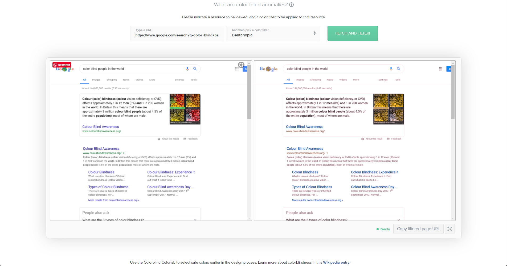
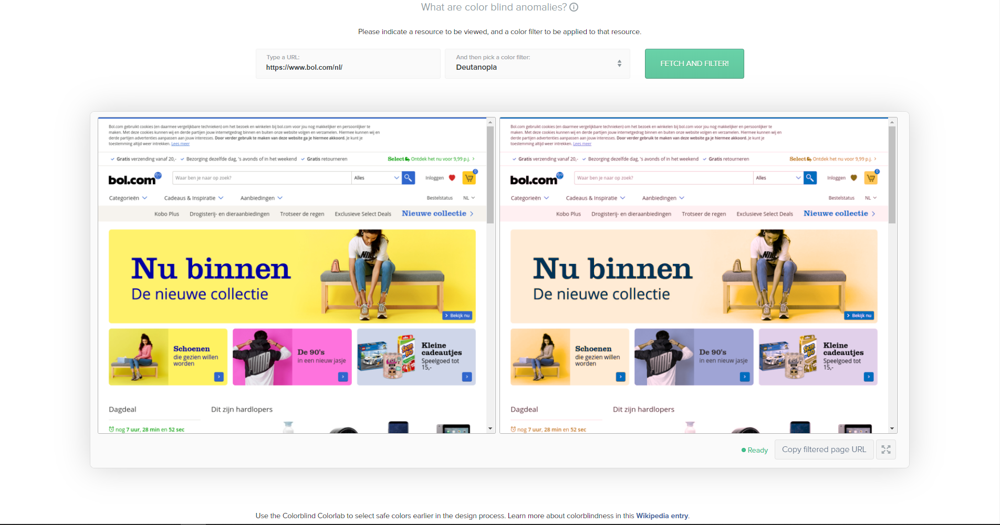

# Browser Technologies
## Opdracht 1.1 - Breek het web
Het Web laten 'breken' door features van het platform bewust uit te zetten. Images, custom fonts, JavaScript, kleur, breedband internet.

### Doel van deze opdracht
Het doel van deze opdracht is om erachter komen dat je misschien aannames hebt die niet kloppen, en om je in te laten leven in de eindgebruiker.

### Features
Onderzoek minimaal twee features. Dat betekent uitvogelen wat het voor impact heeft op de sites die je kent en normaal gebruikt. Kies sites in je directe omgeving: van je werkgever, lokale vereniging, de cafetaria om de hoek, en/of eerdere projecten die je zelf gedaan hebt. Gebruik onderstaande artikelen bij je onderzoek.

1. Kleur uitzetten & kleurenblindheid instellen
2. Muis/Trackpad werkt niet

### Kleur uitzetten & kleurenblindheid instellen

Er zijn veel mensen die kleurenblind zijn, ongeveer 8% van de mannen heeft het wereldwijd. Mijn souschef is het bijvoorbeeld. Hij heeft soms wel een beetje moeite kleuren te onderschijden. Zeker als ze dicht bij elkaar liggen. Dit kan er voor zorgen dat hij niet altijd het een van het ander kan onderscheiden op een website.

Ik heb dit zelf getest op [deze](https://www.toptal.com/designers/colorfilter/) website. Met onder andere de website van bol.com en google.

Om beter te ontwerpen voor mensen die kleurenblind zijn kan je een aantal dingen doen: 
1. Gebruik zowel kleur als iconen - Dit zorgt ervoor dat de gebruiker niet enkel van de kleur afhankelijk is om te zien wat iets betekent.
2. Gebruik zo min mogelijk verschillende kleuren - Hierdoor zal het minder vaak voorkomen dat de kleuren verwarring veroorzaken.
3. Gebruik patronen en textuur om contrast mee te geven - Bijvoorbeeld in grafieken of tabellen.
4. Let op wat je gebruik als contrasterende kleuren en kleurtonen - Word Feud is een goed voorbeeld hiervan.
5. Vermijd slechte kleuren combos - 
Groen & Rood
Groen & Bruin
Blauw & Paars
Groen & Blauw
Licht Groen & Geel
Blauw & Grijs
Groen & Grijs
Groen & Zwart

### Muis/Trackpad werkt niet

Er zijn mensen die niet met een muis of trackpad kunnen werken. Zoals mijn oom bijvoorbeeld. Die had ALS en kon bijna niks bewegen op het laatst. En was zeker niet in staat een muis of trackpad te gebruiken.

Ik heb dit zelf getest op Bol.com. Ik moet zeggen dat het onmogelijk was het menu door te gaan. Er was geen keyboard focus. Hierdoor moest ik gokken waar mijn 'cursor' was. Erg gebruiksonvriendelijk.

Om beter te ontwerpen voor mensen die geen muis of trackpad kunnen gebruiken kun je een aantal dingen doen: 
1. Gebruik duidelijke keyboard focus.
2. Zorg dat alle interactieve elementen bereikt kunnen worden
3. Gebruik een 'skip to content' element.

Lezen
- [The Web I Want](https://dev.to/quii/the-web-i-want-43o)
- [The Role of Enhancement in Web Design by Raluca Budiu](https://www.nngroup.com/articles/enhancement/)
