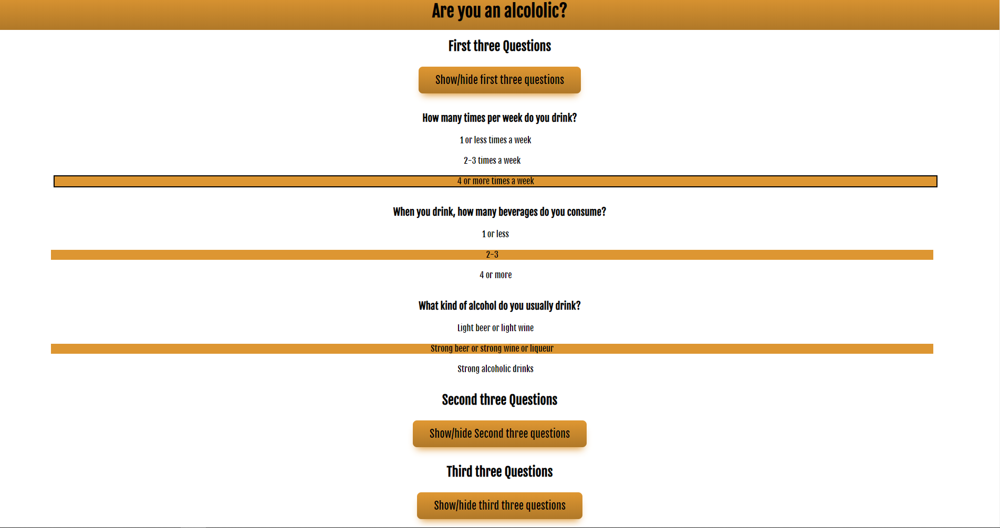
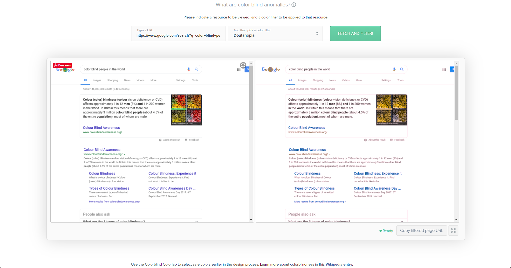
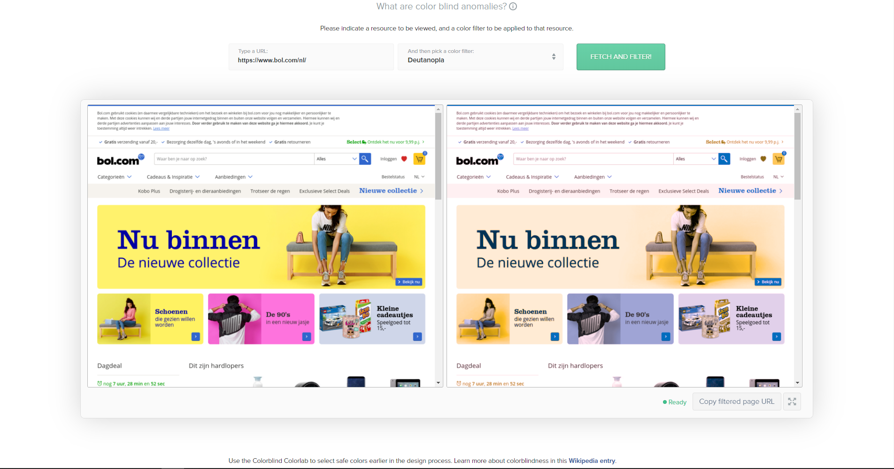
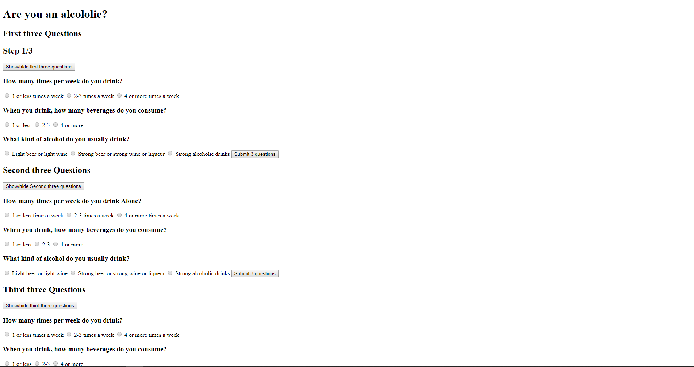
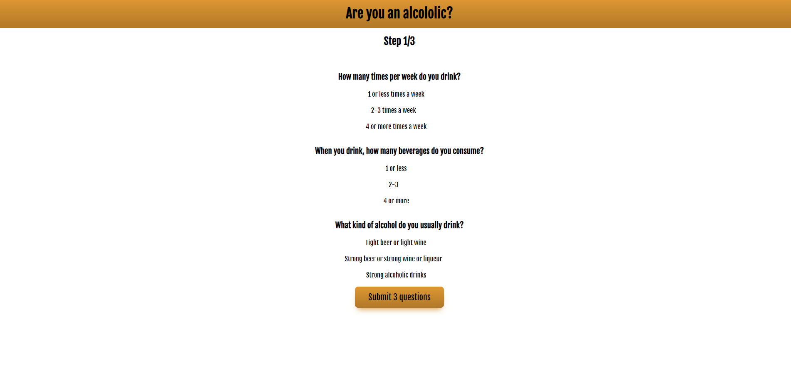
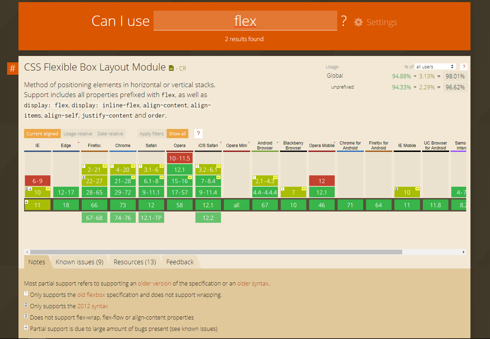

# Browser Technologies @cmda-minor-web 1819

A prototype based on the use case: I want to be able to fill in a survey, with different answer options.

## Introduction
This survey is made as part of a course from [@cmda-minor-web 18-19](https://github.com/cmda-minor-web/browser-technologies-1819). In this course I had to make a website with the aim that all users, with all browsers can see the core functionality. And then to progressively enhance the prototype.

## Table of Contents

- [Feature research](#feature-research)
  - [Colors](#Colors)
  - [No mouse or trackpad](#no-mouse-or-trackpad)
- [Beatbox Kit](#beatbox-kit)
  - [Progressive enhancement](#progressive-enhancement)
    - [Functional and reliable](#functional-and-reliable)
    - [Usable](#usable)
    - [Pleasureable](#pleasureable)
  - [Feature detection](#feature-detection)
    - [HTML](#html)
    - [CSS](#css)
    - [JavaScript](#javascript)
  - [Audits](#audits)
- [Wishlist](#withlist)
- [Sources](#sources)
- [License](#license)

## Feature research
The goal was to research at least two features that are being used on websites and figure out what impact these features have on sites I, and you, know and normally use.

### Colors

There are many people who are colorblind, approximately 8% of men are. This means that almost 1 in 10 male users that visit your website is colorblind. An important matter.

I tested for colorblindness on [this](https://www.toptal.com/designers/colorfilter/) website. With sites used by many people, like bol.com and google.com

For better design that takes colorblindness into consideration, you can do a couple of things: 
1. Use colors in combination with icons
2. Use the least amount of different colors
3. Use patterns and texture to add contrast
4. Watch what colors you use for contrast and hues
5. Avoid bad color combinations 
Green & Red
Green & Brown
Blue & Purple
Green & Blue
Light Green & Yellow
Blue & Grey
Green & Grey
Green & Black

### No mouse or trackpad

I tested this on bol.com. It was impossible to get through the menu. There was no keyboard focus.

For better design that takes 'no mouse or trackpad' into consideration, you can do a couple of things: 

1. Use keyboard focus
2. Make sure all interactive elements can be reached
3. Use a 'skip to content' element.

## Survey

In the wireframes below you can see my general idea for the prototype.

### Progressive enhancement
I started with a simple form that works no matter what. I then add css to make it more usable, then I add javascript to make it pleasurable.

#### Functional and reliable
If I turn off css and JS it looks like this. It works but its not really nice, is it?

#### Usable
If I turn off JS It looks like this. Better but we can add more.

#### Pleasurable
With everything on it looks like this. We have progressive disclosure!

### Feature detection

#### CSS

I dont use that many modern css properties. But I checked them anyway.

1. Flex
Flex is supported in most browsers. Only older IE browsers have some issues.

2. Others

Other css properties that dont need fallbacks are transform, transition en so forth. They only apply to the pleasurable layer and when they dont work, the website still does.

#### JavaScript

ES6

Usually I write alot of ES6 like arrow functions, const, let etc. For this project I used none of yhose things.

## License 
See the [LICENSE file](https://github.com/Mennauu/browser-technologies-1819/blob/master/LICENSE) for license rights and limitations (MIT).

