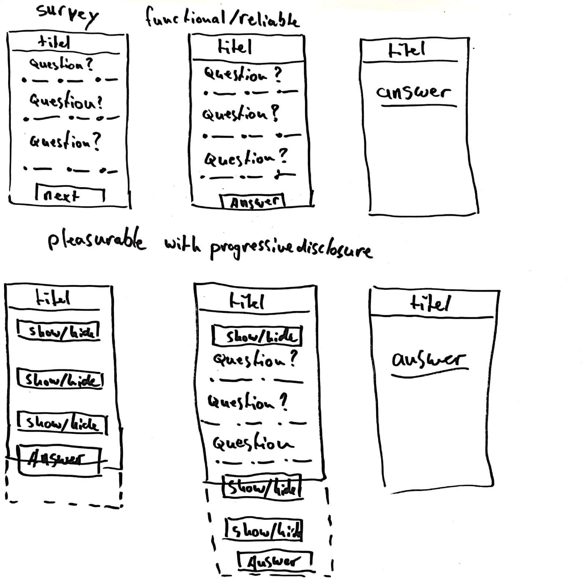
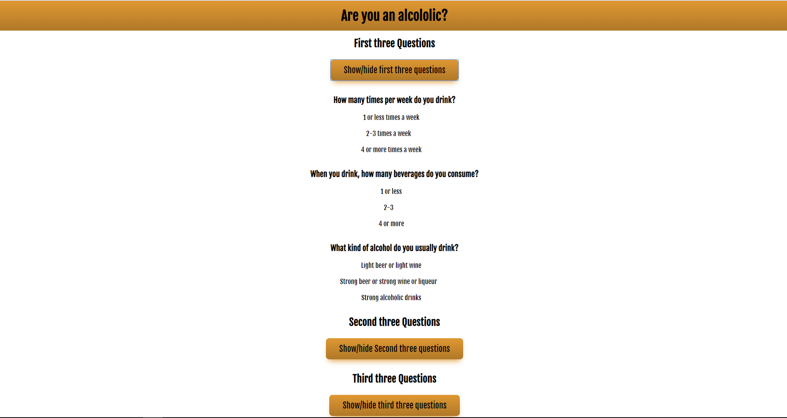

# Browser Technologies @cmda-minor-web 1819

A prototype based on the use case: I want to be able to fill in a survey, with different answer options.


## Introduction
This survey is made as part of a course from [@cmda-minor-web 18-19](https://github.com/cmda-minor-web/browser-technologies-1819). In this course I had to make a website with the aim that all users, with all browsers can see the core functionality. And then to progressively enhance the prototype.

## Table of Contents

- [Feature research](#feature-research)
  - [Colors](#Colors)
  - [No mouse or trackpad](#no-mouse-or-trackpad)
- [Survey](#survey)
  - [Progressive enhancement](#progressive-enhancement)
    - [Functional and reliable](#functional-and-reliable)
    - [Usable](#usable)
    - [Pleasureable](#pleasureable)
  - [Feature detection](#feature-detection)
    - [CSS](#css)
    - [JavaScript](#javascript)


## Feature research
The goal was to research at least two features that are being used on websites and figure out what impact these features have on sites I, and you, know and normally use.

### Colors

There are many people who are colorblind, approximately 8% of men are. This means that almost 1 in 10 male users that visit your website is colorblind. An important matter.

I tested for colorblindness on [this](https://www.toptal.com/designers/colorfilter/) website. With sites used by many people, like bol.com and google.com


For better design that takes colorblindness into consideration, you can do a couple of things: 
1. Use colors in combination with icons
2. Use the least amount of different colors
3. Use patterns and texture to add contrast
4. Watch what colors you use for contrast and hues
5. Avoid bad color combinations 
Green & Red
Green & Brown
Blue & Purple
Green & Blue
Light Green & Yellow
Blue & Grey
Green & Grey
Green & Black

### No mouse or trackpad

I tested this on bol.com. It was impossible to get through the menu. There was no keyboard focus.

For better design that takes 'no mouse or trackpad' into consideration, you can do a couple of things: 

1. Use keyboard focus
2. Make sure all interactive elements can be reached
3. Use a 'skip to content' element.

## Survey

In the wireframes below you can see my general idea for the prototype.



### Progressive enhancement
I started with a simple form that works no matter what. I then add css to make it more usable, then I add javascript to make it pleasurable.

#### Functional and reliable
If I turn off css and JS it looks like this. It works but its not really nice, is it?


#### Usable
If I turn off JS It looks like this. Because the form is split up into three parts the user only ever loses a maximum of three questions. I also added the current progress in the top of the website. Better but we can add more.


#### Pleasureable
With everything on it looks like this. The user can open and close different parts of the survey. Which means less clutter. We have progressive disclosure!



### Feature detection

#### CSS

I dont use that many modern css properties. But I checked them anyway.

1. Flex
Flex is supported in most browsers. Only older IE browsers have some issues.


2. REM and EM

Both are widely [supported in al browsers](https://caniuse.com/#search=rem), except for really old browser versions, like Internet Explorer 7 and below

```CSS 
section{
    margin: 16px; /* fallback */
    margin: 1em;
    text-align: center;
}
```

3. Gradients

Really [bad support in Safari](https://caniuse.com/#search=css%20gradient), and iOS Safari. 

```CSS
header{
    background: #DD9632; /* fallback */
    background: linear-gradient(to bottom, #DD9632 5%, #B07828 100%);
}
```

4. Others

Other css properties that dont need fallbacks are transform, transition en so forth. They only apply to the pleasurable layer and when they dont work, the website still does.

#### JavaScript

1. ES6

Usually I write alot of ES6 like arrow functions, const, let etc. For this project I used none of those things. I then checked every line of code to see if there are functionalities in the javascript that don't work in older browsers. These are the functionalities that needed 

```JavaScript
/* Before */
const hiddenForms = document.querySelectorAll(".form");
document.addEventListener("DOMContentLoaded", ()=> {
  hiddenForms.forEach{ form => {
    form.classList.add("noShow")
  })
})
/* After */
var hiddenForms = document.querySelectorAll(".form");
document.addEventListener("DOMContentLoaded", function () {
  hiddenForms.forEach(function (form) {
    form.classList.add("noShow")
  })
})
```

2. fetch()

Fetch() isn't [supported in older versions of modern browsers](https://caniuse.com/#search=fetch) and not at all in Internet Explorer. But fetch is a modern replacement for XMLHttpRequest, so I've rewritten my code into XMLHttpRequests.

```JavaScript
/* before */
fetch("/jsSurvey", {
    method: "POST",
    headers: {
        "Content-Type": "application/json"
    },
    body: JSON.stringify(data)
})
/* after */
var xhr = new XMLHttpRequest();
xhr.open("POST", "/jsSurvey", true);
xhr.setRequestHeader("Content-Type", "application/json");
xhr.send(JSON.stringify(data))
```

3. forEach() on NodeList

Internet Explorer doesn't support a regular forEach on a NodeList (neither do old versions of modern browsers), which means the entire site breaks on IE 9, 10 and 11 and older browsers. I found a solution on [Stack Overflow](https://stackoverflow.com/questions/13433799/why-doesnt-nodelist-have-foreach).

```JavaScript
var hiddenForms = document.querySelectorAll(".form");
/* before */
hiddenForms.forEach(function (form) {
  form.classList.add("noShow")
})
/* after */
Array.prototype.forEach.call(hiddenForms, function (form) {
  form.classList.add("noShow")
})
```
